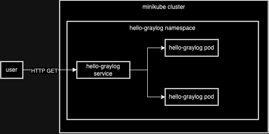

# hello-graylog

This repo contains a simple nodejs web application which returns the string "Hello Graylog!".

## How to run
### Pre-requisites
In order to run this you need a machine with the following tools installed.

- Docker desktop or equivalent: Instructions to install docker desktop can be found [here](https://docs.docker.com/desktop/)
- Docker hub account: In addition to having docker desktop installed, you will need to have a docker hub account in order to push the built docker image to. You can create one [here](https://hub.docker.com/signup)
- Minikube: Minikube installation instructions can be found [here](https://minikube.sigs.k8s.io/docs/start/)
- Helm: Installation instructions can be found [here](https://helm.sh/docs/intro/install/)
- Git: Instructions for installing git can be found [here](https://git-scm.com/book/en/v2/Getting-Started-Installing-Git)
- kubectl: Installation instructions are [here](https://kubernetes.io/docs/tasks/tools/)


### Cloning the repo & code overview
Assuming you have all the pre-requisites installed, clone this repo by running the following command in a terminal

`git clone https://github.com/barisi/hello-graylog.git` over HTTPS or `git clone git@github.com:barisi/hello-graylog.git` over ssh.

Then navigate into the cloned directory with the following command

`cd hello-graylog`

The source code for the application is in the `src` folder, there is a `Dockerfile` which defines how the application should be packaged in a container and a helm chart in the `hello-graylog` folder.


### Building the docker image
In order build the application container run the following command

`docker build -t <docker_hub_username>/hello-graylog:v0.1 .`

Next, log into docker hub in your terminal using the following command

`docker login`

You will be prompted for your username and password.

Finally, push the built image up to docker hub using the following command

`docker push <docker_hub_username>/hello-graylog:v0.1`

Remember to replace _<docker_hub_username>_ with your docker hub username.

### Deploying locally
Open the file `hello-graylog/values.yaml` in a code editor of your choice and replace `barisi/hello-graylog` on line 8 with `<docker_hub_username>/hello-graylog`, again remembering to substitute _<docker_hub_username>_ with your docker hub username.

Next, navigate back to your terminal and run the following command

`helm install hello-graylog ./hello-graylog/ --create-namespace --namespace hello-graylog`

This will deploy the application onto your minikube cluster in the namespace `hello-graylog`. To se the status of the application deployed, run the following command.

`$ kubectl get pods -n hello-graylog`

You should get output similar to the below.
```                                                                         
NAME                             READY   STATUS    RESTARTS   AGE
hello-graylog-57ddc978f9-52w97   1/1     Running   0          27s
hello-graylog-57ddc978f9-gks9b   1/1     Running   0          42s
```

### Accessing the application
In order to access the application, run the following command

`kubectl port-forward service/hello-graylog 4002:http -n hello-graylog`

You should get output similar to the below.
```                                                                         
Forwarding from 127.0.0.1:4002 -> 4002
Forwarding from [::1]:4002 -> 4002
```
Finally, navigate to [http://localhost:4002/](http://localhost:4002/) in a browser while leaving your terminal window open in order to access the application

## Assumptions
The main assumption is that this is a proof-of-concept meant to show how an application/microservice can be deployed and managed in kubernetes using helm. 

It doesn't attempt to showcase a _full stack_ application with web, application and database tiers and any caching layers inbetween.

## Architecture


## Further enhancements
The first enhancement to this solution would be in the application code. It will require unit tests to ensure that it functions as expected. If there is any information processing required, that would be separated out to a different _application_ service and if there is any data storage or retrieval required an appropriate database with access restricted to the application layer will be added.

Depending on scaling and performance requirements, caching layers can be added, for example a CDN for the web layer and an in-memory cache like redis for the database layer.

Next a fully automated CI pipeline which will build, test and push the docker image to a registry will be developed in other to ensure repeatability of builds.

A CD pipeline will also be developed to take the built docker image and deploy it in muiltiple environments through to production using the helm chart. This will be done following a GitOps paradigmn using ArgoCD.

Lastly a load balancer and an ingress controller will be introduced into the architecture in order to facilitate access to the application from outside the kubernetes cluster. A web application firewall can also be added to the loadbalancer in order to detect and block malicious traffic.